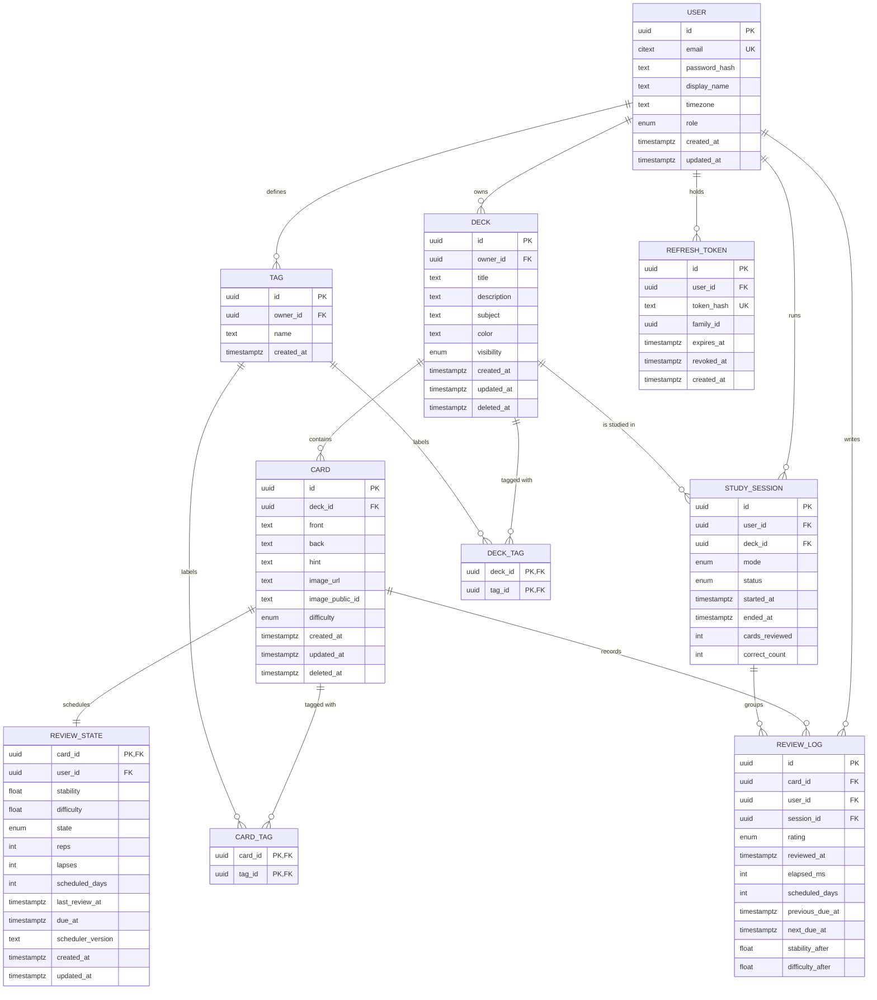

# Data Model — DeckUp

| Field       | Value                                                                                                     |
| ----------- | --------------------------------------------------------------------------------------------------------- |
| **Version** | 1.0                                                                                                       |
| **Date**    | 2026-09-22                                                                                                |
| **Status**  | Approved — implemented with Prisma migrations (Phases 2–3)                                                |
| **Related** | [`overview.md`](./overview.md) · [`adr/ADR-0003-database-and-orm.md`](./adr/ADR-0003-database-and-orm.md) |

> [!NOTE]
> **At a glance** — 10 models, 7 enums and 5 immutable migrations. UUID primary keys, soft
> delete for decks and cards, append-only `ReviewLog`, and a denormalized `user_id` on
> `ReviewState` to serve the daily queue with a single index.

---

## 1. Entity-relationship diagram



## 2. Entity catalog

### 2.1 `User`

| Column          | Type          | Constraints                     | Notes                                                                     |
| --------------- | ------------- | ------------------------------- | ------------------------------------------------------------------------- |
| `id`            | `uuid`        | PK, default `gen_random_uuid()` |                                                                           |
| `email`         | `text`        | unique, not null                | Lower-cased by the `Email` value object; case-insensitive by construction |
| `password_hash` | `text`        | not null                        | Argon2id encoded hash                                                     |
| `display_name`  | `text`        | not null, 1–80 chars            |                                                                           |
| `timezone`      | `text`        | not null, default `UTC`         | IANA identifier; drives local-day logic                                   |
| `role`          | `UserRole`    | not null, default `STUDENT`     | `STUDENT`, `ADMIN` (future)                                               |
| `created_at`    | `timestamptz` | not null, default `now()`       |                                                                           |
| `updated_at`    | `timestamptz` | not null                        |                                                                           |

### 2.2 `RefreshToken`

| Column       | Type          | Constraints                      | Notes                                        |
| ------------ | ------------- | -------------------------------- | -------------------------------------------- |
| `id`         | `uuid`        | PK                               |                                              |
| `user_id`    | `uuid`        | FK → `User`, `onDelete: Cascade` |                                              |
| `token_hash` | `text`        | unique, not null                 | SHA-256 of the opaque token; never plaintext |
| `family_id`  | `uuid`        | not null                         | Rotation family for replay detection         |
| `expires_at` | `timestamptz` | not null                         | 30 days                                      |
| `revoked_at` | `timestamptz` | nullable                         | Set on rotation or logout                    |
| `created_at` | `timestamptz` | not null                         |                                              |

### 2.3 `Deck`

| Column        | Type             | Constraints                      | Notes                           |
| ------------- | ---------------- | -------------------------------- | ------------------------------- |
| `id`          | `uuid`           | PK                               |                                 |
| `owner_id`    | `uuid`           | FK → `User`, `onDelete: Cascade` |                                 |
| `title`       | `text`           | not null, 1–120 chars            |                                 |
| `description` | `text`           | nullable, ≤ 500 chars            |                                 |
| `subject`     | `text`           | nullable, ≤ 60 chars             | Free text used for filtering    |
| `color`       | `text`           | nullable, hex `#RRGGBB`          | UI accent                       |
| `visibility`  | `DeckVisibility` | not null, default `PRIVATE`      | `PRIVATE`, `UNLISTED`, `PUBLIC` |
| `created_at`  | `timestamptz`    | not null                         |                                 |
| `updated_at`  | `timestamptz`    | not null                         |                                 |
| `deleted_at`  | `timestamptz`    | nullable                         | Soft delete                     |

### 2.4 `Tag`, `DeckTag`, `CardTag`

| Entity    | Columns                                | Constraints                                              |
| --------- | -------------------------------------- | -------------------------------------------------------- |
| `Tag`     | `id`, `owner_id`, `name`, `created_at` | `UNIQUE (owner_id, name)`; `onDelete: Cascade` from user |
| `DeckTag` | `deck_id`, `tag_id`                    | Composite PK; cascades from both sides                   |
| `CardTag` | `card_id`, `tag_id`                    | Composite PK; cascades from both sides                   |

Tags are per-owner: two students may both have a tag named `exam-1` without collision.

### 2.5 `Card`

| Column            | Type             | Constraints                      | Notes                                  |
| ----------------- | ---------------- | -------------------------------- | -------------------------------------- |
| `id`              | `uuid`           | PK                               |                                        |
| `deck_id`         | `uuid`           | FK → `Deck`, `onDelete: Cascade` |                                        |
| `front`           | `text`           | not null, non-empty              | Question / prompt (BR-03.1)            |
| `back`            | `text`           | not null, non-empty              | Answer (BR-03.1)                       |
| `hint`            | `text`           | nullable, ≤ 300 chars            |                                        |
| `image_url`       | `text`           | nullable                         | Cloudinary delivery URL                |
| `image_public_id` | `text`           | nullable                         | Cloudinary public id (deletion/rename) |
| `difficulty`      | `CardDifficulty` | nullable                         | `EASY`, `MEDIUM`, `HARD` (authoring)   |
| `created_at`      | `timestamptz`    | not null                         |                                        |
| `updated_at`      | `timestamptz`    | not null                         |                                        |
| `deleted_at`      | `timestamptz`    | nullable                         | Soft delete                            |

### 2.6 `ReviewState` — one row per card

| Column              | Type          | Constraints                | Notes                                     |
| ------------------- | ------------- | -------------------------- | ----------------------------------------- |
| `card_id`           | `uuid`        | PK, FK → `Card`, cascade   | One scheduling state per card             |
| `user_id`           | `uuid`        | FK → `User`, cascade       | Denormalized for the queue index          |
| `stability`         | `double`      | not null, default 0        | FSRS memory stability (days)              |
| `difficulty`        | `double`      | not null, default 0        | FSRS item difficulty (1–10)               |
| `state`             | `CardState`   | not null, default `NEW`    | `NEW`, `LEARNING`, `REVIEW`, `RELEARNING` |
| `reps`              | `int`         | not null, default 0        | Total reviews                             |
| `lapses`            | `int`         | not null, default 0        | Times forgotten after graduating          |
| `scheduled_days`    | `int`         | not null, default 0        | Last scheduled interval (analytics)       |
| `last_review_at`    | `timestamptz` | nullable                   |                                           |
| `due_at`            | `timestamptz` | not null, default `now()`  | Queue driver                              |
| `scheduler_version` | `text`        | not null, default `fsrs-6` | Algorithm version used                    |
| `created_at`        | `timestamptz` | not null                   |                                           |
| `updated_at`        | `timestamptz` | not null                   |                                           |

### 2.7 `ReviewLog` — immutable history

| Column             | Type           | Constraints                    | Notes                            |
| ------------------ | -------------- | ------------------------------ | -------------------------------- |
| `id`               | `uuid`         | PK                             |                                  |
| `card_id`          | `uuid`         | FK → `Card`, cascade           |                                  |
| `user_id`          | `uuid`         | FK → `User`, cascade           |                                  |
| `session_id`       | `uuid`         | FK → `StudySession`, `SetNull` | Nullable if session was deleted  |
| `rating`           | `ReviewRating` | not null                       | `AGAIN`, `HARD`, `GOOD`, `EASY`  |
| `reviewed_at`      | `timestamptz`  | not null                       | Server time (authoritative)      |
| `elapsed_ms`       | `int`          | nullable                       | Time to answer                   |
| `scheduled_days`   | `int`          | not null                       | Interval assigned by this review |
| `previous_due_at`  | `timestamptz`  | nullable                       | Audit trail                      |
| `next_due_at`      | `timestamptz`  | not null                       | Audit trail                      |
| `stability_after`  | `double`       | not null                       | FSRS output snapshot             |
| `difficulty_after` | `double`       | not null                       | FSRS output snapshot             |

Rows are append-only: no update or delete endpoints exist for review logs.

### 2.8 `StudySession`

| Column           | Type            | Constraints                | Notes                              |
| ---------------- | --------------- | -------------------------- | ---------------------------------- |
| `id`             | `uuid`          | PK                         |                                    |
| `user_id`        | `uuid`          | FK → `User`, cascade       |                                    |
| `deck_id`        | `uuid`          | FK → `Deck`, cascade       |                                    |
| `mode`           | `SessionMode`   | not null, default `DUE`    | `DUE`, `AHEAD`, `ALL`              |
| `status`         | `SessionStatus` | not null, default `ACTIVE` | `ACTIVE`, `COMPLETED`, `ABANDONED` |
| `started_at`     | `timestamptz`   | not null                   |                                    |
| `ended_at`       | `timestamptz`   | nullable                   |                                    |
| `cards_reviewed` | `int`           | not null, default 0        |                                    |
| `correct_count`  | `int`           | not null, default 0        | Ratings `GOOD` + `EASY`            |

## 3. Indexes and query rationale

| Index                               | Serves                                           |
| ----------------------------------- | ------------------------------------------------ |
| `User(email)` unique                | Sign in / registration duplicate check           |
| `RefreshToken(token_hash)` unique   | Refresh validation                               |
| `RefreshToken(user_id)`             | Revoke all sessions of a user                    |
| `Deck(owner_id, deleted_at)`        | Deck list (active decks first)                   |
| `Deck(owner_id, subject)`           | Filter by subject (US-02, AC-02.2)               |
| `Deck(visibility)`                  | Public catalog (Phase 8)                         |
| `Tag(owner_id, name)` unique        | Tag reuse and deduplication                      |
| `Card(deck_id, deleted_at)`         | Deck detail listing                              |
| `ReviewState(user_id, due_at)`      | Daily queue (US-04, AC-04.1) — the hottest query |
| `ReviewLog(user_id, reviewed_at)`   | Streak and retention windows (AC-04.4, AC-04.5)  |
| `ReviewLog(card_id, reviewed_at)`   | Card history and first-review retention rule     |
| `StudySession(user_id, started_at)` | Session history and dashboard                    |
| `StudySession(deck_id, status)`     | Resume/abandon active sessions                   |

## 4. Design decisions

| Decision                               | Rationale                                                                                                                                                                                                        |
| -------------------------------------- | ---------------------------------------------------------------------------------------------------------------------------------------------------------------------------------------------------------------- |
| **UUID primary keys**                  | Safe to expose in URLs; no enumeration of users' data.                                                                                                                                                           |
| **Plain `text` email + normalization** | The domain `Email` value object trims and lower-cases before persisting, so the unique index behaves case-insensitively without the `citext` extension (fewer database privileges and a simpler migration path). |
| **Soft delete (`deleted_at`)**         | Deleting a deck or card must not destroy review history used by analytics.                                                                                                                                       |
| **Immutable `ReviewLog`**              | Analytics and audit require append-only history.                                                                                                                                                                 |
| **Denormalized `user_id` on state**    | Enables the single `(user_id, due_at)` queue index without joins.                                                                                                                                                |
| **`scheduler_version`**                | Future FSRS parameter changes stay auditable and reproducible.                                                                                                                                                   |
| **UTC everywhere**                     | Local-day logic is derived from `User.timezone` at query time.                                                                                                                                                   |
| **`image_public_id`**                  | Allows deleting/replacing the Cloudinary asset when a card is updated.                                                                                                                                           |

## 5. Prisma mapping (target schema)

```prisma
enum DeckVisibility { PRIVATE UNLISTED PUBLIC }
enum CardDifficulty { EASY MEDIUM HARD }
enum ReviewRating   { AGAIN HARD GOOD EASY }
enum CardState      { NEW LEARNING REVIEW RELEARNING }
enum SessionStatus  { ACTIVE COMPLETED ABANDONED }
enum UserRole       { STUDENT ADMIN }

model User {
  id            String   @id @default(uuid()) @db.Uuid
  email         String   @unique
  passwordHash  String   @map("password_hash")
  displayName   String   @map("display_name")
  timezone      String   @default("UTC")
  role          UserRole @default(STUDENT)
  createdAt     DateTime @default(now()) @map("created_at") @db.Timestamptz(3)
  updatedAt     DateTime @updatedAt @map("updated_at") @db.Timestamptz(3)

  decks         Deck[]
  tags          Tag[]
  refreshTokens RefreshToken[]
  studySessions StudySession[]
  reviewLogs    ReviewLog[]
  reviewStates  ReviewState[]

  @@map("users")
}

model Deck {
  id          String         @id @default(uuid()) @db.Uuid
  ownerId     String         @map("owner_id") @db.Uuid
  title       String
  description String?
  subject     String?
  color       String?
  visibility  DeckVisibility @default(PRIVATE)
  createdAt   DateTime       @default(now()) @map("created_at") @db.Timestamptz(3)
  updatedAt   DateTime       @updatedAt @map("updated_at") @db.Timestamptz(3)
  deletedAt   DateTime?      @map("deleted_at") @db.Timestamptz(3)

  owner        User           @relation(fields: [ownerId], references: [id], onDelete: Cascade)
  cards        Card[]
  deckTags     DeckTag[]
  studySessions StudySession[]

  @@index([ownerId, deletedAt])
  @@index([ownerId, subject])
  @@map("decks")
}

model Card {
  id            String          @id @default(uuid()) @db.Uuid
  deckId        String          @map("deck_id") @db.Uuid
  front         String
  back          String
  hint          String?
  imageUrl      String?         @map("image_url")
  imagePublicId String?         @map("image_public_id")
  difficulty    CardDifficulty?
  createdAt     DateTime        @default(now()) @map("created_at") @db.Timestamptz(3)
  updatedAt     DateTime        @updatedAt @map("updated_at") @db.Timestamptz(3)
  deletedAt     DateTime?       @map("deleted_at") @db.Timestamptz(3)

  deck        Deck         @relation(fields: [deckId], references: [id], onDelete: Cascade)
  reviewState ReviewState?
  reviewLogs  ReviewLog[]
  cardTags    CardTag[]

  @@index([deckId, deletedAt])
  @@map("cards")
}

model ReviewState {
  cardId           String    @id @map("card_id") @db.Uuid
  userId           String    @map("user_id") @db.Uuid
  stability        Float     @default(0)
  difficulty       Float     @default(0)
  state            CardState @default(NEW)
  reps             Int       @default(0)
  lapses           Int       @default(0)
  scheduledDays    Int       @default(0) @map("scheduled_days")
  lastReviewAt     DateTime? @map("last_review_at") @db.Timestamptz(3)
  dueAt            DateTime  @default(now()) @map("due_at") @db.Timestamptz(3)
  schedulerVersion String    @default("fsrs-6") @map("scheduler_version")
  createdAt        DateTime  @default(now()) @map("created_at") @db.Timestamptz(3)
  updatedAt        DateTime  @updatedAt @map("updated_at") @db.Timestamptz(3)

  card Card @relation(fields: [cardId], references: [id], onDelete: Cascade)
  user User @relation(fields: [userId], references: [id], onDelete: Cascade)

  @@index([userId, dueAt])
  @@map("review_states")
}
```

The remaining models (`RefreshToken`, `Tag`, `DeckTag`, `CardTag`, `ReviewLog`,
`StudySession`) follow the same conventions: `snake_case` tables, `camelCase` fields with
`@map`, UUID keys and explicit cascade rules. The full schema is committed in
`apps/api/prisma/schema.prisma` during Phase 2.

## 6. Migration strategy

- **One migration per increment**; migrations are immutable once applied (SPEC.md §4).
- Phase 2 creates the baseline (`users`, `decks`, `cards`, `tags`, join tables).
- Phase 3 adds `review_states`, `review_logs`, `study_sessions`.
- Destructive changes require a two-step expand/contract migration and a data backfill.
- Production applies migrations with `prisma migrate deploy` as a release step (ADR-0007).

## 7. Card review lifecycle (FSRS)


_Figure 1 — Card review lifecycle. Interactive version: `.archify/lifecycle-fsrs-20261004-024855/fsrs-lifecycle.html`._

A card moves through four scheduling states. `NEW` cards enter `LEARNING` on their first
review; `Good` or `Easy` graduates them to `REVIEW` with long intervals. An `Again` rating
after graduation is a **lapse**: the card enters `RELEARNING` with short steps until `Good`
or `Easy` returns it to `REVIEW`. `Again` and `Hard` keep the card in its current phase.
The `scheduler_version` column records the FSRS algorithm version used for every state.

## 8. SWEBOK V4.0a references

- Cap. 3, §4.4 — Design: data design and persistence.
- Cap. 6, §2.1.1 — Operations: database administration and migrations.
- Cap. 12, §3.4.5 — Quality: data integrity constraints.
