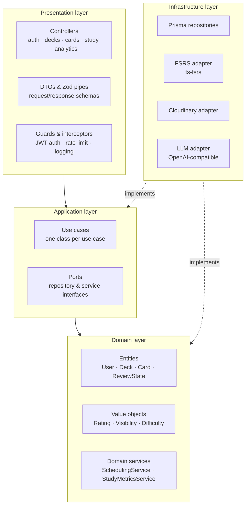

# Architecture Overview — DeckUp

| Field       | Value                                                                                   |
| ----------- | --------------------------------------------------------------------------------------- |
| **Version** | 1.0                                                                                     |
| **Date**    | 2026-09-22                                                                              |
| **Status**  | Approved                                                                                |
| **Method**  | C4 model (context, container, component) · SWEBOK V4.0a, KA02                           |
| **Related** | [`adr/`](./adr) · [`data-model.md`](./data-model.md) · [`openapi.yaml`](./openapi.yaml) |

> [!NOTE]
> **At a glance** — React 19 + Vite 8 web, NestJS 12 + Fastify API in Clean Architecture,
> PostgreSQL 17 via Prisma 7. The web never talks to the database or Cloudinary directly;
> all access goes through the API, which owns the contracts. 8 ADRs record the significant
> decisions.

---

## 1. System context (C4 — Level 1)

DeckUp is a web platform where high school students author flashcard decks and review
them through a spaced-repetition engine.


_Figure 1 — System context (C4 Level 1). Interactive version: `.archify/architecture-system-context-20261004-024855/system-context.html`._

| Element          | Responsibility                                                               |
| ---------------- | ---------------------------------------------------------------------------- |
| **Student**      | The single human actor. Owns decks, studies, and consumes analytics.         |
| **DeckUp**       | The system under design: accounts, decks, cards, scheduling, analytics.      |
| **Cloudinary**   | External managed service for card images (upload, transformation, delivery). |
| **LLM provider** | External AI provider used only by the optional card-generation feature.      |

## 2. Containers (C4 — Level 2)


_Figure 2 — Container view (C4 Level 2). Interactive version: `.archify/architecture-containers-20261004-024855/containers.html`._

| Container           | Technology                       | Responsibility                                                         |
| ------------------- | -------------------------------- | ---------------------------------------------------------------------- |
| **Web application** | React 19, Vite 8, TanStack Query | Presentation, client state, server-state cache, routing, a11y.         |
| **API application** | NestJS 12 + Fastify, Prisma 7    | Business rules, FSRS scheduling, validation, persistence, analytics.   |
| **Database**        | PostgreSQL 17                    | Durable storage; source of truth for scheduling state and review logs. |

The web container never talks to the database or to Cloudinary directly: all access goes
through the API, which owns the contracts.

## 3. API components (C4 — Level 3)

The API follows **Clean Architecture**; dependencies always point inwards.



| Layer              | Contains                                                            | May import                   |
| ------------------ | ------------------------------------------------------------------- | ---------------------------- |
| **Presentation**   | Controllers, DTOs, pipes, guards, interceptors                      | Application                  |
| **Application**    | Use cases (one per action), ports, orchestration                    | Domain                       |
| **Domain**         | Entities, value objects, domain services (FSRS, streaks, retention) | Nothing (pure TypeScript)    |
| **Infrastructure** | Prisma repositories, `ts-fsrs`, Cloudinary and LLM adapters         | Domain + application (ports) |

Key rule: scheduling mathematics (FSRS) and analytics rules live in the **domain** and are
tested without a database, an HTTP server or the `ts-fsrs` library (through a port); the
`ts-fsrs` adapter has its own focused spec.

## 4. Web application structure

```
apps/web/src/
├── app/            # routing, providers, layout
├── features/       # feature-first modules
│   ├── auth/       # sign in / register
│   ├── decks/      # deck list, deck detail, card editor, CSV import/export
│   ├── study/      # study session (queue, flip, ratings, summary, offline queue)
│   ├── analytics/  # streak, retention, forecast charts
│   ├── explore/    # public catalogue and cloning
│   ├── ai/         # AI card suggestions
│   └── landing/    # public home page
├── components/     # shared UI primitives (Tailwind CSS)
├── lib/            # api client, query keys, utilities
└── test/           # setup and test utilities
```

- Server state exclusively through **TanStack Query**; no `fetch` inside components.
- Feature folders are self-contained: routes, hooks, components and tests live together.

## 5. Deployment view


_Figure 3 — Production deployment. Interactive version: `.archify/architecture-deployment-20261004-024855/deployment.html`._

| Environment    | Web             | API                    | Database             |
| -------------- | --------------- | ---------------------- | -------------------- |
| **Local**      | Vite dev server | NestJS watch mode      | Docker Compose PG 17 |
| **Production** | Vercel (CDN)    | Railway (Docker image) | Neon (PostgreSQL 17) |

CI/CD: GitHub Actions runs the five quality gates on every push/PR and deploys `main`
(see [`../04-operations/deployment.md`](../04-operations/deployment.md)).

## 6. Cross-cutting concerns

| Concern           | Approach                                                                                                                          |
| ----------------- | --------------------------------------------------------------------------------------------------------------------------------- |
| **Security**      | Argon2id passwords, JWT access + rotating refresh cookies, rate limiting, Zod validation at the edge, CORS allow-list (ADR-0006). |
| **Contracts**     | Zod schemas in `@deckup/shared`; OpenAPI document as the published REST contract.                                                 |
| **Errors**        | Typed domain errors mapped to RFC 7807-style problem responses by an exception filter.                                            |
| **Observability** | Structured Fastify logs with request IDs (`x-request-id` echoed); `/health` endpoint.                                             |
| **Testing**       | Domain unit tests (Vitest), API integration with real PostgreSQL, web E2E with Playwright.                                        |
| **Accessibility** | WCAG 2.1 AA, keyboard-first study mode.                                                                                           |
| **Time**          | All instants stored in UTC; local-day logic applies the student's IANA timezone.                                                  |

## 7. Decision index

| ADR                                             | Decision                                    |
| ----------------------------------------------- | ------------------------------------------- |
| [ADR-0001](./adr/ADR-0001-monorepo-strategy.md) | Monorepo with pnpm workspaces + Turborepo   |
| [ADR-0002](./adr/ADR-0002-backend-framework.md) | NestJS 12 + Fastify with Clean Architecture |
| [ADR-0003](./adr/ADR-0003-database-and-orm.md)  | PostgreSQL 17 + Prisma 7 with pg driver     |
| [ADR-0004](./adr/ADR-0004-shared-contracts.md)  | Zod contracts in `@deckup/shared`           |
| [ADR-0005](./adr/ADR-0005-spaced-repetition.md) | FSRS via `ts-fsrs` behind a domain port     |
| [ADR-0006](./adr/ADR-0006-authentication.md)    | JWT access + refresh rotation with Argon2id |
| [ADR-0007](./adr/ADR-0007-deployment.md)        | Vercel + Railway + Neon                     |
| [ADR-0008](./adr/ADR-0008-testing-strategy.md)  | Vitest, Supertest and Playwright            |

## 8. SWEBOK V4.0a references

- Cap. 2, §2.1 — _Software architecture fundamentals_: structures and views.
- Cap. 2, §2.4 — _Architecture as significant decisions_ (see ADRs).
- Cap. 2, §3.2 — _Architecture synthesis_: decomposition, layering, dependency rules.
- Cap. 3, §4.2 — _Design patterns_: ports and adapters, repository, dependency injection.
