# Informe General del Sistema — DeckUp

| Campo          | Valor                                                                                          |
| -------------- | ---------------------------------------------------------------------------------------------- |
| **Proyecto**   | DeckUp — plataforma de repaso espaciado con flashcards                                         |
| **Epic**       | Epic 03 — Education (`REQUIREMENTS.pdf`)                                                       |
| **Autor**      | Nelson Fabián Gallego Sánchez                                                                  |
| **Programa**   | Tecnólogo en Análisis y Desarrollo de Software (ADSO) — SENA                                   |
| **Versión**    | 1.0                                                                                            |
| **Fecha**      | 2026-10-02                                                                                     |
| **Estado**     | Sistema implementado y verificado; despliegue en ejecución                                     |
| **Artefactos** | `PT-ERS-01` (requisitos) · `PT-ECU-01` (casos de uso) · este informe (`PT-IGS-01`)             |
| **Fuentes**    | `docs/01-requirements/` · `docs/02-architecture/` · `docs/03-testing/` · `docs/04-operations/` |

> Este informe sigue la estructura institucional de tres partes: (1) características y
> usuarios, (2) plano maestro del software y (3) de la idea a la aplicación. Cada sección
> referencia el artefacto SENA o el documento técnico donde vive el detalle.

---

# Parte 1 — Características y usuarios

## 1. Descripción del sistema

**DeckUp** es una aplicación web full-stack de repaso espaciado para estudiantes de
secundaria que preparan exámenes finales. Permite crear mazos de flashcards
personalizados, enriquecerlos con imágenes, pistas, dificultad y etiquetas, importar
contenido en bloque y repasar mediante un motor de programación **FSRS** (_Free Spaced
Repetition Scheduler_) que maximiza la retención con el mínimo tiempo de estudio.

- **Problema que resuelve:** la relectura pasiva es ineficaz; el repaso activo con
  material propio mejora el desempeño en exámenes, pero las herramientas existentes
  exigen demasiado esfuerzo de carga y no adaptan el calendario al estudiante.
- **Propuesta de valor:** crear → enriquecer → importar → repasar → medir, en un solo
  flujo, con funcionamiento sin conexión y accesibilidad WCAG 2.1 AA.

## 2. Características principales

| #   | Característica                    | Descripción                                                                 |
| --- | --------------------------------- | --------------------------------------------------------------------------- |
| C1  | Cuenta de estudiante              | Registro, inicio de sesión, sesión persistente con rotación de tokens       |
| C2  | Gestión de mazos                  | Título, descripción, asignatura, color, etiquetas y visibilidad             |
| C3  | Autoría de tarjetas               | Anverso/reverso, pista, dificultad, etiquetas y una imagen por cara         |
| C4  | Importación/exportación CSV       | Carga masiva con validación por fila y resumen; exportación del mazo        |
| C5  | Motor de estudio FSRS             | Cola diaria, cuatro calificaciones, reprogramación automática y resumen     |
| C6  | Analítica de estudio              | Racha, repasos del día, vencidas, retención a 30 días y pronóstico a 7 días |
| C7  | Catálogo público y clonado        | Explorar mazos públicos, buscar y clonar con atribución                     |
| C8  | Generación asistida por IA        | Sugerencias de tarjetas a partir de apuntes (proveedor compatible OpenAI)   |
| C9  | Funcionamiento sin conexión (PWA) | Cola local de repasos idempotente que se sincroniza al recuperar la red     |
| C10 | Accesibilidad y teclado           | Atajos de estudio (Espacio, 1–4), foco visible, contraste AA y escaneos axe |

## 3. Usuarios del sistema

| Actor              | Tipo               | Descripción                                                          |
| ------------------ | ------------------ | -------------------------------------------------------------------- |
| **Estudiante**     | Principal          | Crea mazos, estudia, consulta analítica y sincroniza repasos offline |
| **Visitante**      | Secundario         | Consulta la página pública, se registra o inicia sesión              |
| **Administrador**  | Previsto (rol)     | Rol `ADMIN` modelado en datos; sin interfaz dedicada en esta versión |
| **Cloudinary**     | Sistema externo    | Almacenamiento y entrega firmada de imágenes de tarjetas             |
| **Proveedor LLM**  | Sistema externo    | Generación de sugerencias de tarjetas (API compatible con OpenAI)    |
| **PostgreSQL 17**  | Sistema externo    | Persistencia transaccional                                           |
| **GitHub Actions** | Sistema de soporte | Integración continua y despliegue automatizado                       |

## 4. Casos de uso

El sistema tiene **18 casos de uso**: 12 principales y 6 incluidos/extendidos.

| Grupo     | Casos de uso                                                                                                              |
| --------- | ------------------------------------------------------------------------------------------------------------------------- |
| Cuenta    | CU#01 Registrarse · CU#02 Iniciar sesión                                                                                  |
| Mazos     | CU#03 Crear mazo · CU#04 Organizar mazo · CU#10 Exportar mazo · CU#11 Explorar mazos públicos                             |
| Tarjetas  | CU#05 Agregar tarjeta · CU#06 Enriquecer tarjeta · CU#07 Importar CSV · CU#12 Generar tarjetas con IA                     |
| Estudio   | CU#08 Estudiar mazo · CU#09 Ver analítica                                                                                 |
| Incluidos | CU-V Validar CSV · CU-I Almacenar imagen · CU-Q Construir cola · CU-S Programar repaso (FSRS) · CU-E Agregar estadísticas |
| Extendido | CU-R Repasar adelantado                                                                                                   |

- Detalle y trazabilidad: [`../01-requirements/traceability-matrix.md`](../01-requirements/traceability-matrix.md) (`PT-ECU-01`).
- Diagrama de casos de uso: [`../02-architecture/use-case-diagram.puml`](../02-architecture/use-case-diagram.puml).

## 5. Entorno operativo

| Capa         | Tecnología                                                            |
| ------------ | --------------------------------------------------------------------- |
| Navegador    | Aplicación React 19 + Vite 8 + Tailwind CSS 4 (PWA instalable)        |
| Servidor     | API NestJS 12 sobre Fastify, TypeScript 6, Clean Architecture         |
| Datos        | PostgreSQL 17 con Prisma ORM 7 (migraciones versionadas)              |
| Programación | FSRS mediante `ts-fsrs` (versión de scheduler registrada por tarjeta) |
| Contratos    | Zod 4 compartido (`@deckup/shared`) entre web y API                   |
| Calidad      | Vitest 5, Supertest, Playwright + axe-core, ESLint 10, Prettier 3     |
| Construcción | pnpm workspaces + Turborepo; Docker para la API                       |
| Producción   | Vercel (web) · Railway (API) · Neon (PostgreSQL)                      |

---

# Parte 2 — Plano maestro del software

## 6. Arquitectura

- **Estilo:** Clean Architecture en cuatro capas con dependencias hacia adentro
  (`presentation → application → domain`; `infrastructure` implementa puertos del dominio).
- **Monorepo:** `apps/web`, `apps/api`, `packages/shared`, `packages/config`.
- **API:** 31 casos de uso (una clase por operación), 17 puertos de dominio, 10
  controladores y ~31 endpoints bajo el prefijo `/api/v1`.
- **Web:** estructura _feature-first_ (auth, decks, study, analytics, explore, ai,
  account), estado de servidor con TanStack Query y contratos Zod compartidos.
- **Decisiones registradas:** 8 ADR en formato MADR en
  [`../02-architecture/adr/`](../02-architecture/adr/).
- **Vistas C4 y diagramas:** [`../02-architecture/overview.md`](../02-architecture/overview.md).

## 7. Modelo de datos

- **10 modelos:** `User`, `RefreshToken`, `Deck`, `Tag`, `DeckTag`, `Card`, `CardTag`,
  `ReviewState`, `ReviewLog`, `StudySession`.
- **7 enumeraciones:** rol, visibilidad, dificultad, estado de tarjeta, calificación,
  estado y modo de sesión.
- **Reglas destacadas:** borrado lógico de mazos y tarjetas, unicidad de correo,
  idempotencia de repasos (`sessionId + clientReviewId`), bloqueo optimista de la
  programación (`version`) y 5 migraciones inmutables.
- Detalle: [`../02-architecture/data-model.md`](../02-architecture/data-model.md).

## 8. Diagrama de clases

Diagrama UML 2.5 por capas (dominio, servicios, puertos, aplicación, infraestructura y
presentación) con cardinalidades y visibilidad:

- Código PlantUML: [`diagrama-clases.puml`](./diagrama-clases.puml).
- Entidades de dominio puras (sin decoradores de ORM), servicios `SchedulingService` y
  `StudyMetricsService`, y adaptadores que implementan los puertos.

## 9. Tecnologías

Ver §5. Versiones fijadas en [`../../SPEC.md`](../../SPEC.md) §2 y en los `package.json`
de cada espacio de trabajo. TypeScript está anclado a 6.0.x por compatibilidad de
`typescript-eslint` y decoradores nativos de NestJS.

## 10. Integraciones

| Integración         | Uso                                                              | Degradación si falta configuración              |
| ------------------- | ---------------------------------------------------------------- | ----------------------------------------------- |
| Cloudinary          | Imágenes de tarjetas (firma de entrega, borrado del anterior)    | `503` con `application/problem+json`            |
| Proveedor LLM       | Sugerencias de tarjetas desde apuntes                            | `503` con mensaje claro                         |
| Notion              | Publicación de la documentación (10 páginas, script idempotente) | El script exige token; no afecta la app         |
| GitHub Actions      | CI (3 trabajos) y despliegue condicionado a CI verde             | Sin secretos, el despliegue se omite            |
| Vercel/Railway/Neon | Hosting de web, API y base de datos                              | Guía paso a paso en `deployment-walkthrough.md` |

---

# Parte 3 — De la idea a la aplicación

## 11. Prototipado

- **Estado:** no hay mockups de baja/alta fidelidad versionados en el repositorio.
- **Sistema de diseño implementado:** tema oscuro de alto contraste (slate/emerald),
  componentes propios reutilizables (`Button`, `Field`, `Modal` con _focus trap_,
  `Card`, `Badge`, `EmptyState`) y tipografía consistente.
- **Recomendación:** generar el paquete de evidencias visuales con capturas reales de la
  aplicación en ejecución (registro, tablero, detalle de mazo, estudio, analítica y
  cuenta) y anexarlas a la entrega.

## 12. Historias de usuario

Cuatro historias con detalle progresivo (Connextra + BDD), 22 puntos de historia:

| ID    | Nivel         | Título                                   | Prioridad | Estimación |
| ----- | ------------- | ---------------------------------------- | --------- | ---------- |
| US-01 | General       | Crear mazos de flashcards personalizados | Must      | 1 SP       |
| US-02 | Refinada      | Organizar mazos y crear tarjetas básicas | Must      | 3 SP       |
| US-03 | Detallada     | Enriquecer tarjetas e importar material  | Should    | 5 SP       |
| US-04 | Muy detallada | Estudiar con FSRS y analítica            | Must      | 13 SP      |

- Criterios de aceptación en formato Dado/Cuando/Entonces, casos límite, reglas de
  negocio y DoR/DoD: [`../01-requirements/user-story-refinement.md`](../01-requirements/user-story-refinement.md).
- Entregable exportado: `DeckUp - User Story and Refinement - Nelson Fabián Gallego Sánchez.pdf`.

## 13. Plan de trabajo por fases

El proyecto se ejecutó con iteraciones cortas verificadas (equivalente a sprints), cada
una cerrada con los cinco controles de calidad:

| Fase | Alcance                                                            | Fecha                   | Estado     |
| ---- | ------------------------------------------------------------------ | ----------------------- | ---------- |
| 0–2  | Fundación del monorepo, contratos, autenticación, mazos y tarjetas | 2026-09-21/22           | Completada |
| 3    | Motor de estudio FSRS, cola, repasos y registros                   | 2026-09-22              | Completada |
| 4–5  | Interfaz web, sesión de estudio y analítica                        | 2026-09-22              | Completada |
| 6–8  | Exportación, catálogo público, clonado e IA                        | 2026-09-22              | Completada |
| R    | Remediación post-revisión (fases 1–5 del `PLAN.md`)                | 2026-09-22              | Completada |
| H    | Endurecimiento: tokens, FSRS, imágenes, offline, accesibilidad     | 2026-09-25              | Completada |
| D    | Guía de despliegue y verificación de la imagen de producción       | 2026-09-26 / 2026-10-02 | Completada |
| C    | Continuidad: cuenta de usuario, publicación y despliegue           | 2026-10-02              | En curso   |

## 14. Prototipo funcional y evidencias de calidad

El prototipo es una aplicación completa y verificable, no un maquetín:

| Evidencia                        | Resultado verificado (2026-10-02)                              |
| -------------------------------- | -------------------------------------------------------------- |
| Pruebas unitarias                | **171/171** (8 contratos compartidos · 120 API · 43 web)       |
| Pruebas de integración de la API | **72/72** contra PostgreSQL 17 real                            |
| Pruebas de navegador (E2E)       | **8/8** con escaneos de accesibilidad axe en 7 pantallas       |
| Análisis estático                | ESLint 10 y TypeScript 6 sin errores                           |
| Construcción de producción       | Web y API compilan; imagen Docker del API verificada           |
| Imagen de producción             | `GET /api/v1/health` → `200 {"status":"ok","version":"0.1.0"}` |
| Integración continua             | 3 trabajos en GitHub Actions (calidad, API e2e, navegador)     |
| Cobertura de dominio             | Umbrales configurados (sentencias ≥80 %, ramas ≥85 %)          |

- Plan y casos de prueba: [`../03-testing/test-plan.md`](../03-testing/test-plan.md) y
  [`../03-testing/test-cases.md`](../03-testing/test-cases.md).
- Operación y despliegue: [`../04-operations/deployment-walkthrough.md`](../04-operations/deployment-walkthrough.md).
- **Producción:** web en <https://deckup.vercel.app> · API en
  <https://deckup-api-production.up.railway.app> (health verificado y smoke test
  de navegador en verde).

## 15. Refinamiento y trazabilidad

- **Refinamiento progresivo:** el registro de iteraciones (nivel 0 → 4) documenta qué
  atributo se añadió en cada paso (alcance, criterios BDD, RNF medibles, casos límite,
  reglas de negocio y DoR/DoD).
- **Trazabilidad completa:** 12 requisitos funcionales, 8 no funcionales, 18 casos de
  uso, 4 historias y 66 casos de prueba enlazados en la matriz
  [`../01-requirements/traceability-matrix.md`](../01-requirements/traceability-matrix.md).
- **Estado:** todos los requisitos figuran como _Implemented_ con evidencia automatizada.

## 16. Evidencias visuales del sistema en ejecución

Capturas tomadas del sistema real en ejecución local (`localhost:5173`), con datos
sembrados a través de la API. Todas comparten el mismo viewport (1360×880) para
mantener la consistencia del documento.

### 16.1 Acceso

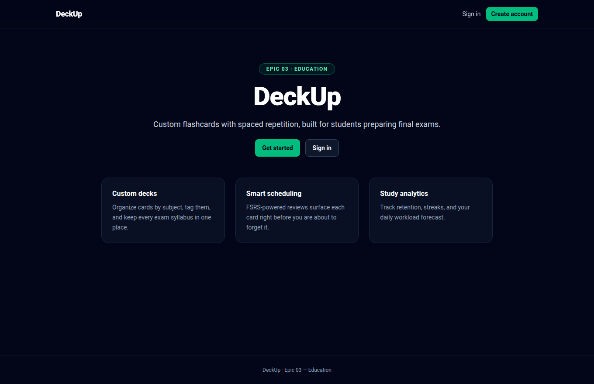

_Figura 1. Página de bienvenida: propuesta de valor y características principales._

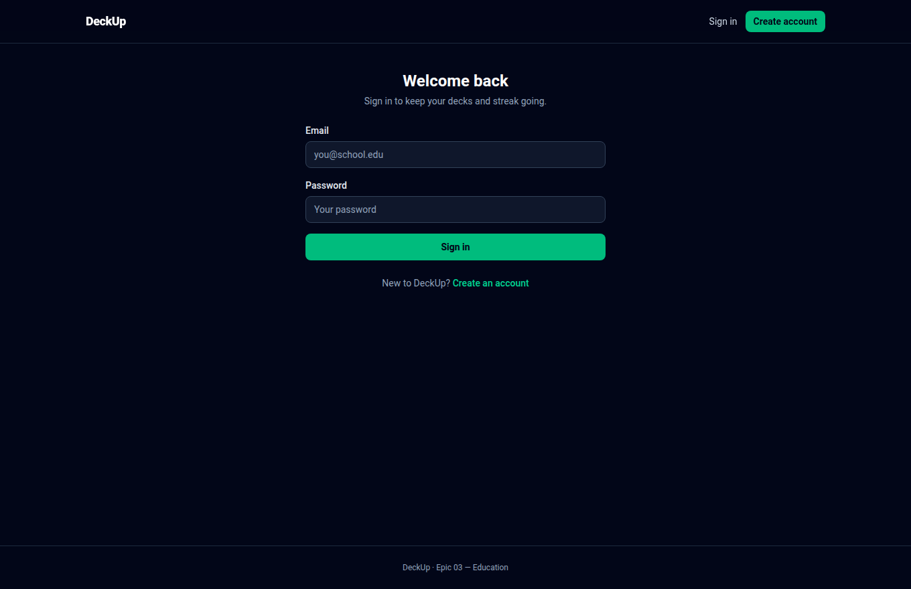

_Figura 2. Formulario de inicio de sesión con validación accesible._

### 16.2 Gestión de mazos y tarjetas

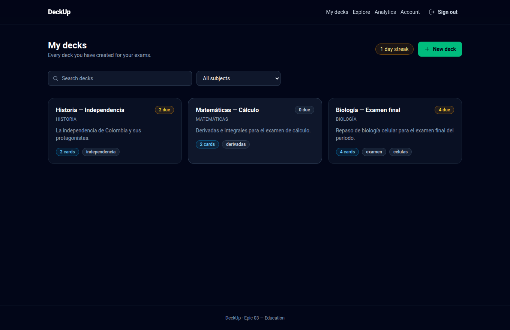

_Figura 3. Tablero del estudiante: mazos por asignatura, racha y vencimientos._

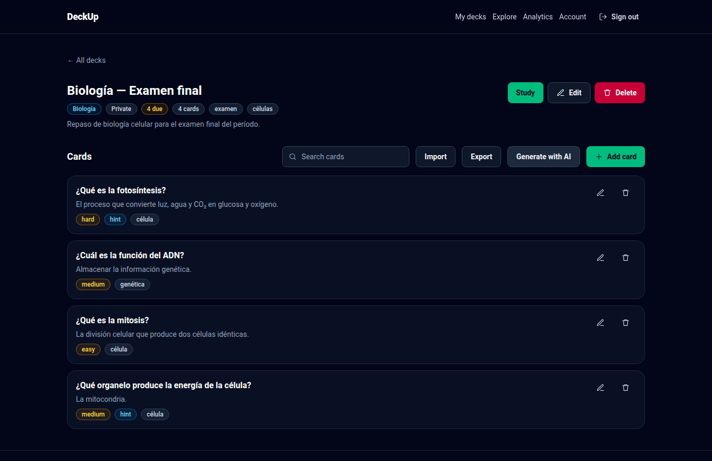

_Figura 4. Detalle del mazo con tarjetas, dificultad, pistas y etiquetas._

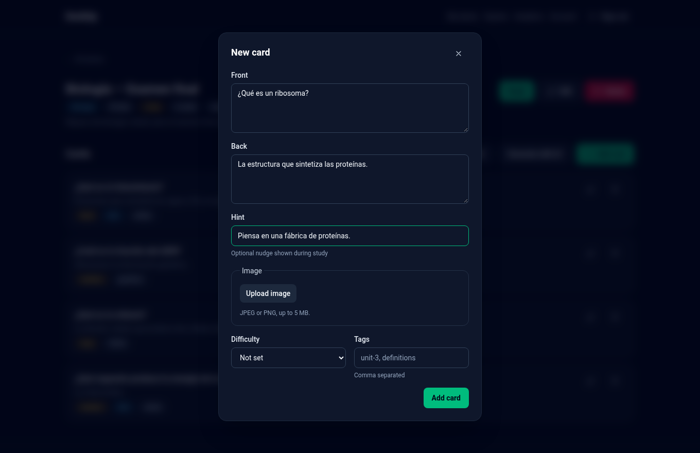

_Figura 5. Diálogo de creación de tarjeta con imagen, dificultad y etiquetas._

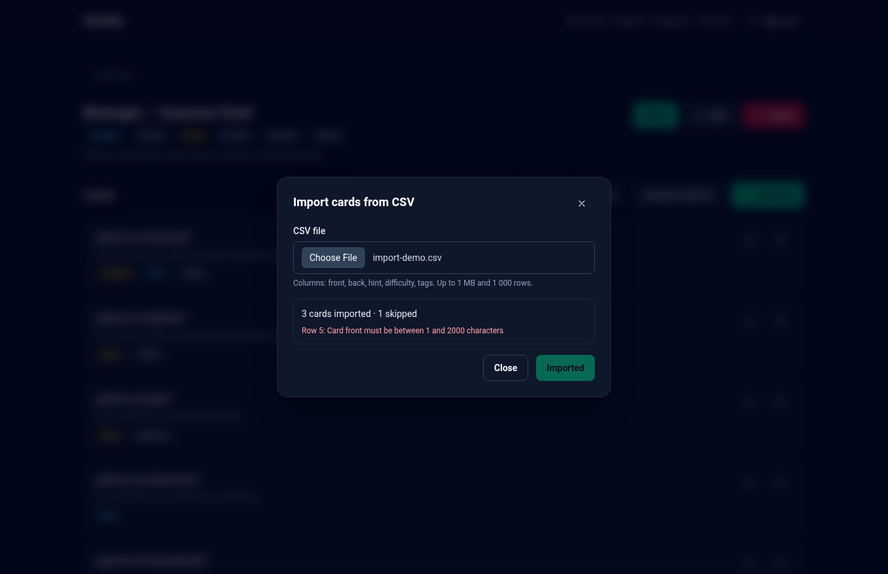

_Figura 6. Importación CSV con resumen por fila y reporte de errores._

### 16.3 Estudio con FSRS

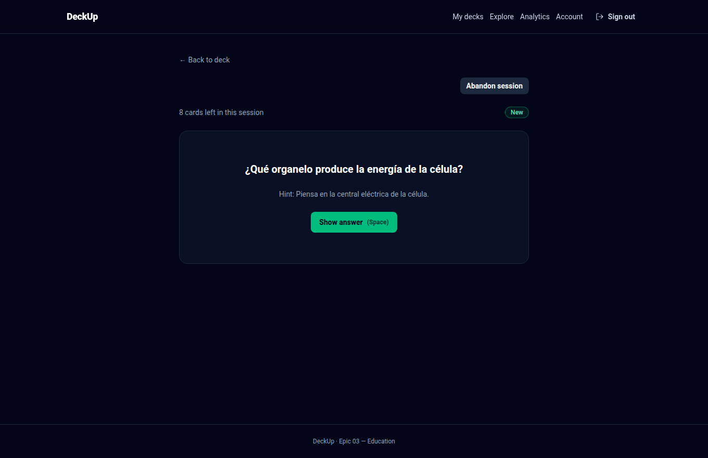

_Figura 7. Sesión de estudio: pregunta con pista y contador de tarjetas restantes._

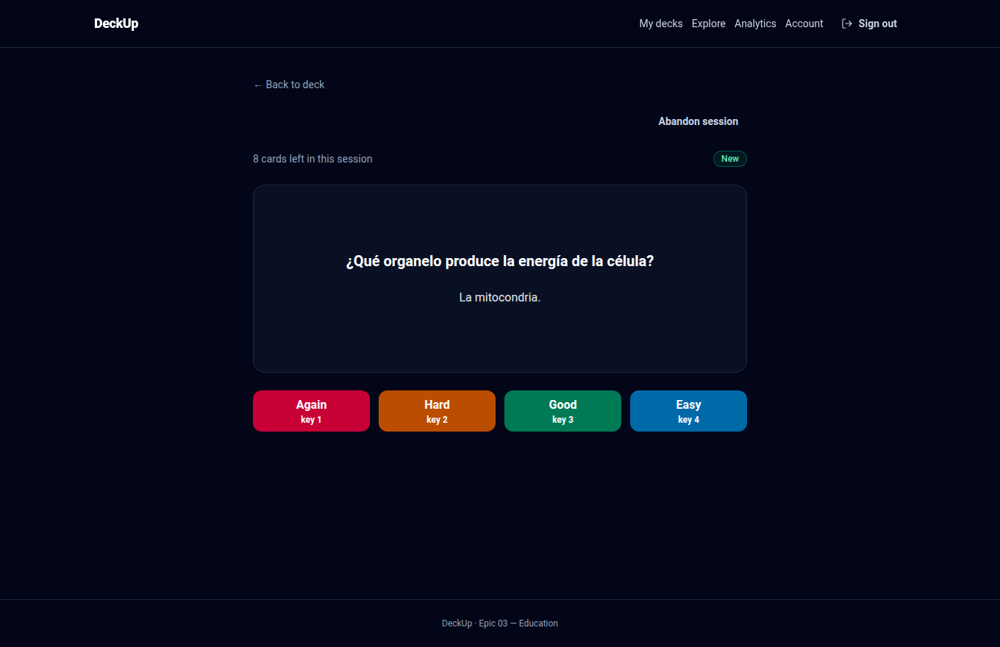

_Figura 8. Respuesta revelada con las cuatro calificaciones FSRS._

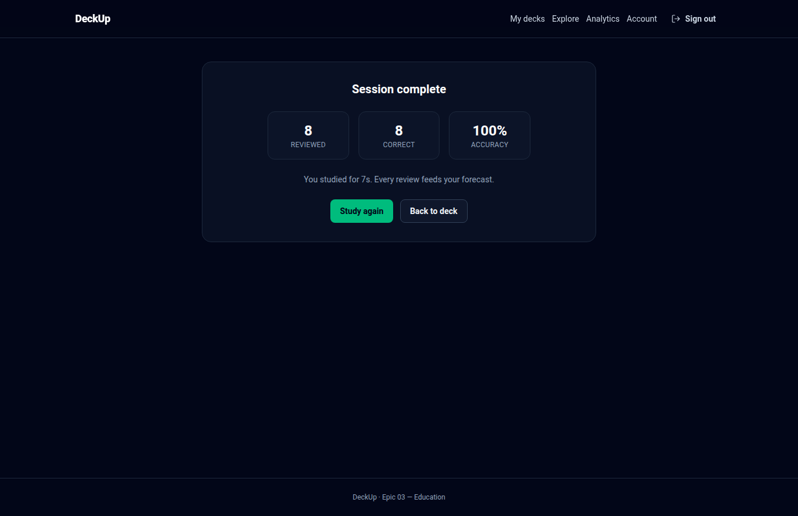

_Figura 9. Resumen de sesión: tarjetas repasadas, aciertos y precisión._

### 16.4 Analítica y comunidad

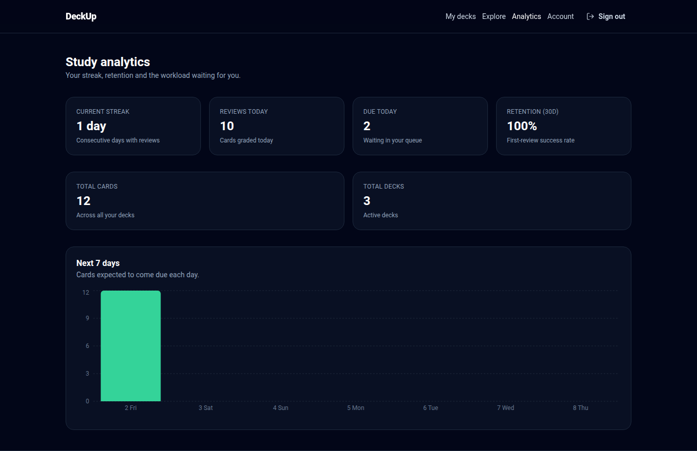

_Figura 10. Analítica: racha, retención a 30 días y pronóstico a 7 días._

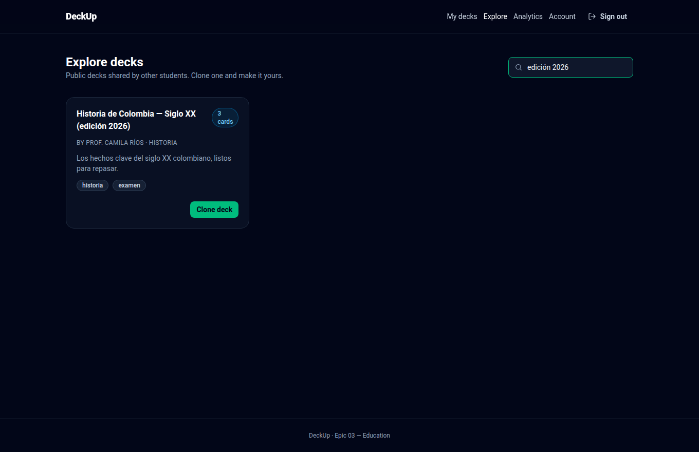

_Figura 11. Catálogo público con búsqueda y clonado de mazos._

### 16.5 Cuenta

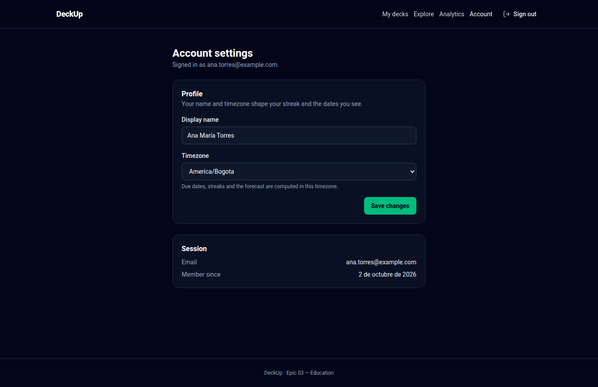

_Figura 12. Configuración de cuenta: nombre, zona horaria y datos de la sesión._

Nota. Capturas del sistema en ejecución (localhost:5173).

---

## Anexo A — Correspondencia con plantillas SENA

| Plantilla / artefacto      | Contenido en este repositorio                                              |
| -------------------------- | -------------------------------------------------------------------------- |
| `PT-ERS-01` Requisitos     | `docs/01-requirements/` (HU refinadas, RNF consolidados, glosario, matriz) |
| `PT-ECU-01` Casos de uso   | Matriz de trazabilidad §2–4 y `use-case-diagram.puml`                      |
| Informe general (3 partes) | Este documento                                                             |
| Evidencias de ejecución    | Capturas de la aplicación (recomendadas) y reportes de pruebas             |

## Anexo B — Lista de chequeo del informe

- [x] Parte 1 completa (características, usuarios, casos de uso, entorno).
- [x] Parte 2 completa (arquitectura, datos, clases, tecnologías, integraciones).
- [x] Parte 3 completa (prototipado, historias, fases, prototipo funcional, refinamiento).
- [x] Totales consistentes con la matriz del proyecto (12 RF · 8 RNF · 18 CU · 4 HU · 66 TC).
- [x] Referencias a los artefactos y documentos fuente.
- [x] Capturas de evidencia anexadas (12 figuras en `evidencias/`).
- [x] URLs de producción anexadas: web <https://deckup.vercel.app> · API
      <https://deckup-api-production.up.railway.app> (health verificado).

## Anexo C — Glosario de siglas

| Sigla   | Significado                                       |
| ------- | ------------------------------------------------- |
| ADSO    | Análisis y Desarrollo de Software (programa SENA) |
| ADR     | Architecture Decision Record                      |
| BDD     | Behavior-Driven Development                       |
| CU      | Caso de uso                                       |
| DoR/DoD | Definition of Ready / Definition of Done          |
| FSRS    | Free Spaced Repetition Scheduler                  |
| HU      | Historia de usuario                               |
| PWA     | Progressive Web App                               |
| RF/RNF  | Requisito funcional / no funcional                |
| TC      | Test case (caso de prueba)                        |
